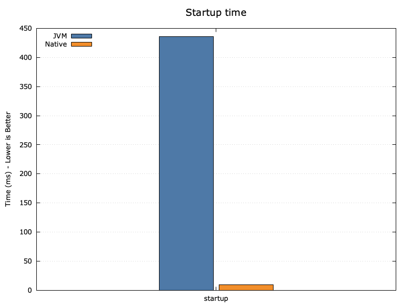
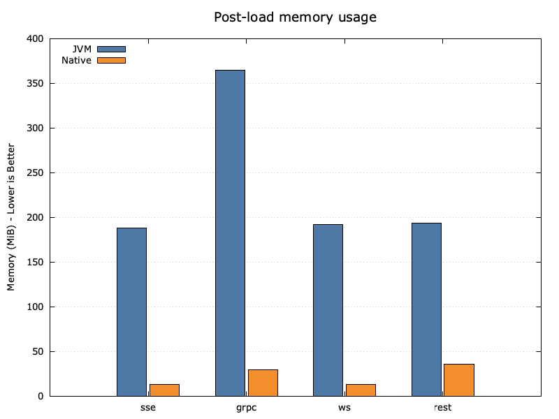
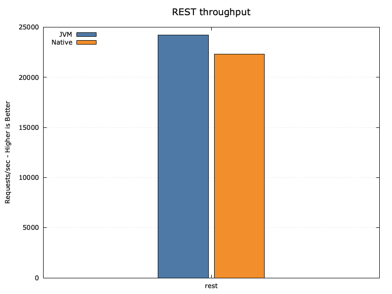
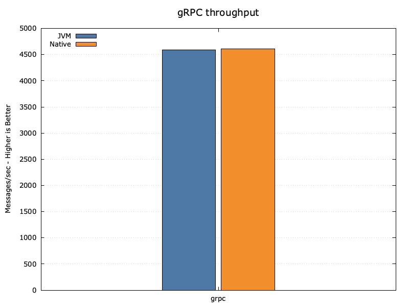

# Quarkus & GraalVM Communication Patterns Lab

[](https://app.codacy.com/gh/apenlor/quarkus-communication-patterns-lab/dashboard?utm_source=gh&utm_medium=referral&utm_content=&utm_campaign=Badge_grade)
[](https://github.com/apenlor/quarkus-communication-patterns-lab/actions/workflows/ci.yml)
[](https://github.com/apenlor/quarkus-communication-patterns-lab/releases/latest)
[](https://opensource.org/licenses/MIT)

A repository that systematically benchmarks and compares common client-server communication patterns (
REST, SSE, WebSockets, gRPC) on the Quarkus framework, contrasting the performance characteristics of the standard 
**JVM** against a **GraalVM native executable**.

---

## Final analysis and results

This project conducted a playground analysis of four communication protocols on two different Java runtimes. The
benchmarks focused on startup time, memory consumption, and protocol-specific throughput. The complete benchmark suite
can be reproduced from source using the instructions in the sections below.

### Executive summary

The results draw a clear and compelling picture of the trade-offs between the JVM and GraalVM native runtimes.

* **GraalVM Native is the champion of efficiency.** It delivers dramatically faster startup times (over **40x
  faster**) and a significantly lower memory footprint (consuming **4-5x less RAM**) across all tested workloads. This
  makes it an ideal choice for serverless functions, containerized microservices in resource-constrained environments,
  and any application where rapid scaling and low idle cost are critical.

* **The JVM remains a throughput powerhouse.** For pure, high-concurrency request processing (as seen in the REST
  benchmark), the mature Just-In-Time (JIT) compiler of the JVM can match or even slightly exceed the performance of the
  ahead-of-time (AOT) compiled native executable. This demonstrates that for long-running, performance-critical
  applications where efficiency is secondary to raw speed, the JVM is still an excellent and highly competitive choice.

Ultimately, the choice of runtime is not about "better" or "worse," but about selecting the right tool for the specific
business and operational context.

### Key metrics summary

The table below summarizes the key findings from the benchmark suite.

| Metric                      | Protocol | JVM      | Native   |   Winner   |
|-----------------------------|:--------:|:---------|:---------|:----------:|
| **Startup Time** (ms)       | (Global) | `436.4`  | `9.2`    | **Native** |
| **REST Throughput** (req/s) |   REST   | `24,198` | `22,295` |  **JVM**   |
| **gRPC Throughput** (msg/s) |   gRPC   | `4,586`  | `4,614`  |   (Tie)    |
| **Post-Load Memory** (MiB)  |   gRPC   | `364.5`  | `29.4`   | **Native** |
| **Post-Load Memory** (MiB)  |   REST   | `193.8`  | `35.3`   | **Native** |

### Visualizations

The following graphs highlight the most significant findings from the analysis.

#### Startup time

The native executable's startup time is an order of magnitude faster than the JVM's, making it exceptionally well-suited
for elastic, scale-from-zero environments.



#### Post-load memory usage

Across all protocols, the native executable demonstrates a dramatically lower memory footprint after a period of
sustained load. The most significant difference was observed after the gRPC benchmark, where the JVM consumed over 12
times more memory.



#### Throughput comparison

For stateless, high-concurrency workloads like REST, the JVM's JIT optimizations allow it to maintain a slight
throughput advantage. For more complex, stateful streaming workloads like gRPC, the performance of the two runtimes is
virtually identical.




---

## How to reproduce the results

This project is fully self-contained and reproducible using Docker.

### Prerequisites

- Docker and Docker Compose
- A shell environment (Bash, Zsh)
- `gnuplot` (for regenerating graphs)

### 1. Run the complete benchmark suite

This single command orchestrates the entire process: it builds all necessary images, runs startup benchmarks, executes
all performance and memory tests, and cleans up the environment afterward.

```bash
./scripts/run-all-benchmarks.sh
```

This will populate the `bench-clients/results/raw/` directory with all raw log files.

### 2. Collect results and generate graphs

These two commands parse the raw logs into a `summary.csv` and then use that data to generate all graphical
visualizations.

```bash
# First, collect and parse the raw logs
./scripts/collect-results.sh

# Next, generate the PNG graphs from the collected data
./scripts/generate-graphs.sh
```

The final dataset is at `bench-clients/results/summary.csv`, and the graphs are in `docs/benchmarks/graphs/`.

---

## Project deep dive

This repository was built incrementally to demonstrate a clean, evolutionary design process. To explore the architecture
and access the interactive demos, check out the specific Git tag for each phase.

### Core principles

- **Reproducibility:** The entire lab is runnable via Docker Compose.
- **Phased Development:** The project is built additively, with each phase frozen by an immutable Git tag.
- **Documented Evolution:** Architectural decisions are captured in **Architectural Decision Records (ADRs)** and
  detailed within Pull Requests.

### Project evolution

| Phase                             | Status | Focus                                                                                                     | Key Artifacts                                                                                                                                                                                      |
|-----------------------------------|:------:|-----------------------------------------------------------------------------------------------------------|----------------------------------------------------------------------------------------------------------------------------------------------------------------------------------------------------|
| **1.0: REST Baseline**            |   ✅    | Establish the project structure, a JSON REST API, and baseline JVM performance metrics.                   | [Code @ `v1.0-rest`](https://github.com/apenlor/quarkus-communication-patterns-lab/tree/v1.0-rest) <br/> [PR #1](https://github.com/apenlor/quarkus-communication-patterns-lab/pull/1)             |
| **2.0: Server-Sent Events (SSE)** |   ✅    | Introduce one-way server-to-client streaming and add the GraalVM native executable for comparison.        | [Code @ `v2.0-sse`](https://github.com/apenlor/quarkus-communication-patterns-lab/tree/v2.0-sse) <br/> [PR #4](https://github.com/apenlor/quarkus-communication-patterns-lab/pull/4)               |
| **3.0: WebSockets**               |   ✅    | Implement full-duplex communication and unify the entire benchmark suite on a modern `k6` toolchain.      | [Code @ `v3.0-websockets`](https://github.com/apenlor/quarkus-communication-patterns-lab/tree/v3.0-websockets) <br/> [PR #6](https://github.com/apenlor/quarkus-communication-patterns-lab/pull/6) |
| **4.0: gRPC**                     |   ✅    | Implement a contract-first RPC service and engineer a custom benchmark for stateful streaming.            | [Code @ `v4.0-grpc`](https://github.com/apenlor/quarkus-communication-patterns-lab/tree/v4.0-grpc) <br/> [PR #8](https://github.com/apenlor/quarkus-communication-patterns-lab/pull/8)             |
| **5.0: RSocket (Investigation)**  |   ❌    | Investigate RSocket and formally exclude it due to significant incompatibilities and technical obstacles. | [ADR-003](docs/adr/003-exclude-rsocket-implementation.md)                                                                                                                                          |
| **6.0: Final Analysis**           |   ✅    | Implement a fully automated suite for benchmark orchestration, data collection, and visualization.        | [Code @ `v6.0-final`](https://github.com/apenlor/quarkus-communication-patterns-lab/tree/v6.0-final) <br/> [PR #15](https://github.com/apenlor/quarkus-communication-patterns-lab/pull/15)         |
